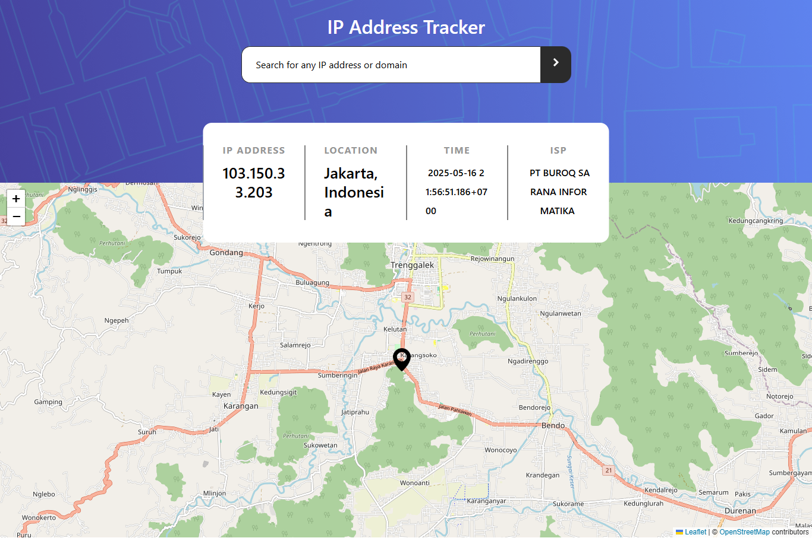

🌍 IP Address Tracker
A simple and modern web application to track and visualize the location of an IP address using a map.

## Welcome! 👋

Thanks for checking out this front-end coding challenge.

[Frontend Mentor](https://www.frontendmentor.io) challenges help you improve your coding skills by building realistic projects.

**To do this challenge, you need a basic understanding of HTML, CSS and JavaScript.**

🚀 Features
Search for any IP address or domain

Display IP details: ISP, Location (City & Country), Time Zone

Real-time map rendering with interactive marker

Smooth fly-to animation on map

Responsive design using TailwindCSS

🛠️ Tech Stack
⚛️ React.js – Component-based UI

🎨 TailwindCSS – Utility-first CSS for fast styling

🗺️ Leaflet & React-Leaflet – Interactive maps

🌐 Geo IP API – Geolocation data from ipgeolocation.io
(Can be swapped with geo.ipify.org if needed)

📦 Installation
bash
Copy
Edit
git clone https://github.com/your-username/ip-address-tracker.git
cd ip-address-tracker
npm install
🧪 Running the App Locally
bash
Copy
Edit
npm run dev
Open http://localhost:5173 in your browser to view the app.

🧾 API Reference
This project uses ipgeolocation.io API. Make sure you have your API key:

Example endpoint:

url
Copy
Edit
https://api.ipgeolocation.io/ipgeo?apiKey=YOUR_API_KEY&ip=IP_ADDRESS
Replace YOUR_API_KEY with your actual API key.

If you want to use geo.ipify.org instead, update the useFetch hook and adjust the data fields accordingly.

📁 Project Structure
arduino
Copy
Edit
├── public/
├── src/
│   ├── components/
│   │   ├── Map.jsx
│   │   └── MarkerPoint.jsx
│   ├── hooks/
│   │   └── useFetch.js
│   ├── App.jsx
│   └── main.jsx
├── tailwind.config.js
├── index.css
└── README.md
📷 Screenshots
(Add screenshots here for better presentation)

✨ To Do
Add domain name support

Improve error messages for invalid IPs

Unit testing with Jest or Vitest

UI improvements for mobile
## Deploying your project

As mentioned above, there are many ways to host your project for free. Our recommended hosts are:

- [Vercel]([https://ip-tracker-orpin-gamma.vercel.app/])
